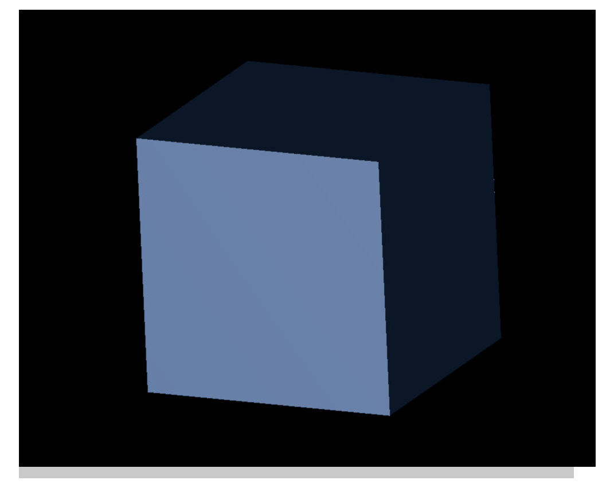
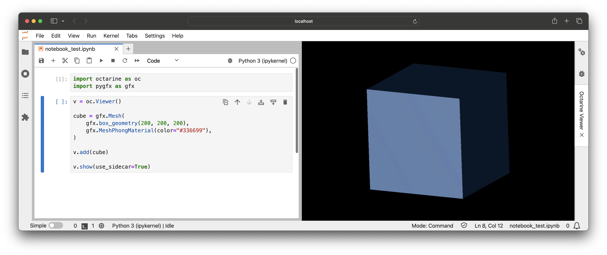
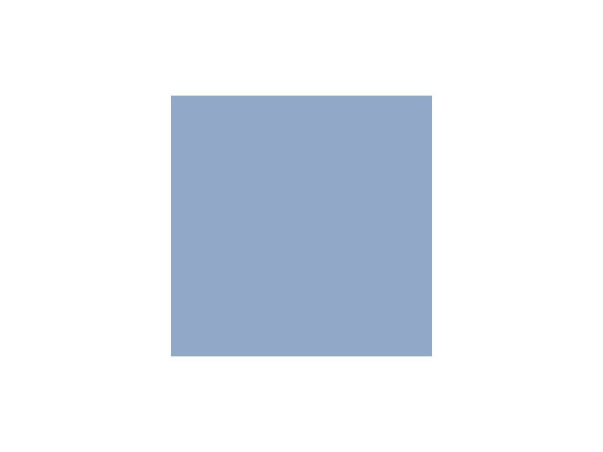

# The Basics

You can use the `octarine.Viewer` in both Jupyter environments and interactive shells such as [IPython](https://github.com/ipython/ipython). The functionality is the same but the handling differs slightly.

## Jupyter Lab/Notebook

```python
import octarine as oc
import pygfx as gfx

# Initialize a new Viewer
v = oc.Viewer()

# Make a simple cube
cube = gfx.Mesh(
    gfx.box_geometry(200, 200, 200),
    gfx.MeshPhongMaterial(color="#336699"),
)

# Add to viewer
v.add(cube)

# This will show the viewer this cell
v.show()
```

!!! important

    The `.show()` method generates and returns a widget wrapping the `Viewer`. In order for it to be displayed
    this _has_ to be on the last line of the cell. The only other alternative is this:

    ```python
    from IPython.display import display
    display(v.show())  # display the widget
    ...
    do other stuff
    ```



!!! tip "Resizing the widget"

    You can adjust the size of the widget either when creating the viewer via
    the `height` and `width` arguments, or afterwards by clicking + dragging the
    lower right corner of the widget.

### Sidecar

[Sidecar](https://github.com/jupyter-widgets/jupyterlab-sidecar) is a Jupyter widget that
lets you put widgets such as the `Viewer` to the side of your Jupyter window.

To install:

```
pip install sidecar
```

Then in the notebook:

```python
# Initialize a new Viewer
v = oc.Viewer()

# Add the cube we already made
v.add(cube)

# Show widget but put it in the sidecar
v.show(use_sidecar=True)
```



## IPython

Start IPython by running the `ipython` command from the terminal. Once you're in
the Python shell:

```Python
>>> import octarine as oc
>>> import pygfx as gfx

>>> # Start the main event loop for qt
>>> # (see below for explanation)
>>> %gui qt

>>> # This will immediately open an empty viewer window
>>> v = oc.Viewer()

>>> # Make a simple cube
>>> cube = gfx.Mesh(
...     gfx.box_geometry(200, 200, 200),
...     gfx.MeshPhongMaterial(color="#336699"),
... )

>>> # Add to viewer
>>> v.add(cube)
```


!!! warning "The main event loop"

    `octarine.Viewer` will need to hook into IPython's main event loop. There are two
    catches here:

    1. You may have to start the event loop manually either via the `%gui` magic command,
    via start-up arguments (e.g. `ipython --gui qt`) or via [config files](https://ipython.org/ipython-doc/dev/config/intro.html).
    2. The active main event loop has to be compatible with the `pygfx` backend you're
    using. At this point, the safest bet is to use `%gui qt`.


## Offscreen

What if you just want to take a quick snapshot without bothering with a
window/widget? No problem:

```python
import octarine as oc
import pygfx as gfx

# Open a fresh offscreen viewer
# (this will not spawn a window)
v = oc.Viewer(offscreen=True)

# Add mesh to viewer
v.add(cube)

# Adjust camera view to frontal
v.set_view('XY')

# Take a snapshot
v.screenshot('cube.png', alpha=True)
```

